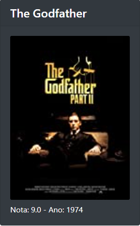

DAY 04:

No desafio de hoje, você vai trabalhar com a saída e gerar uma página HTML a partir da lista de objetos que você
já tem no seu código Java.

A ideia será criar uma página HTML onde você possa ver as informações sobre o filme, incluindo o pôster
* Exemplo: 

  

### 🛠️ Abrir e rodar o projeto
* Criar uma conta no IMDB para ter a chave de acesso ao serviço (apiKey), mas cuidado, essa chave não deve ser commitada no Github ou em outro repositório!
* No VM Arguments do programa colocar a url: https://imdb-api.com/en/API/Top250Movies/*(apiKey)*

### 🔨  Funcionalidades do projeto
- `Funcionalidade 1`: Gerar uma pagina HTML com a lista  **Movie**